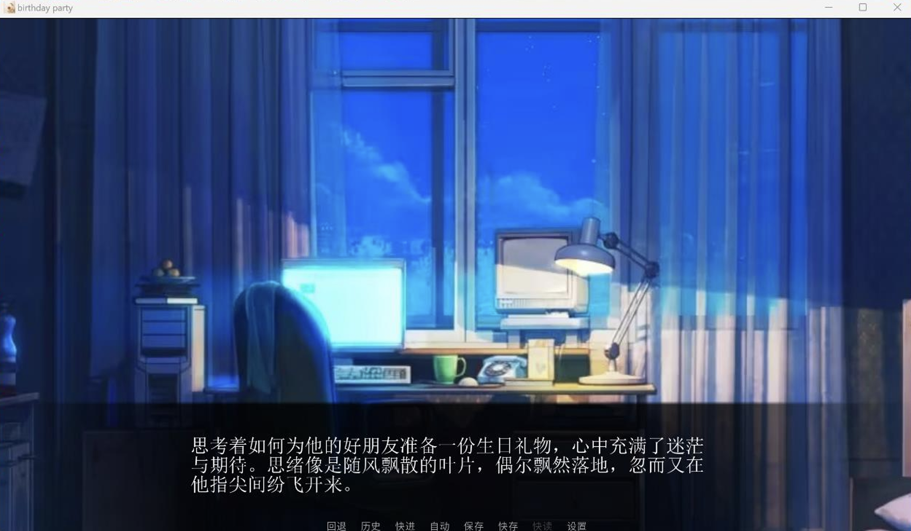

# 🎉 Birthday Party

 
 

一款基于 Ren'Py 引擎开发的视觉小说游戏，体验大学生云帆为好友戴戴筹备生日惊喜的温暖故事。  
充满友情、成长与创意元素，多周目体验乐趣无穷！

---

## 📖 游戏特色

- 🎭 互动式剧情选择
- 🌟 多分支 & 多结局
- 🧩 隐藏彩蛋探索
- 🎨 精美角色立绘与场景设计
- 📱 跨平台支持（PC/平板/手机）

---

## 🛠️ 快速启动

1. 下载项目文件
2. 解压缩
3. Windows 用户双击 `BirthdayParty.exe`  
   Mac 用户运行 `BirthdayParty.app`
4. 也可以使用 [Ren'Py](https://www.renpy.org/) 手动启动项目

---

## 🖥️ 推荐配置

| 硬件        | 推荐配置         |
| ----------- | ---------------- |
| CPU         | Intel i5 或以上   |
| 内存        | 8 GB 或以上       |
| 显卡        | 支持 OpenGL 3.0+ |
| 分辨率      | 1920×1080+       |

| 软件环境 | 说明                     |
| -------- | ------------------------ |
| Windows  | 10 / 11                   |
| macOS    | 10.15 Catalina 或以上版本 |
| Linux    | 兼容主流发行版             |

---

## 🎮 游戏截图

---

## ✨ 特别鸣谢

感谢所有支持、参与制作和测试的朋友们！  
也感谢玩家们的热情反馈与鼓励❤️

---

